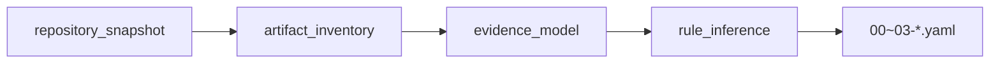

# Output Rules

- 바뀐 부분만 보여줘, 파일 전체 다시 출력하지 마
- 설명이랑 요약은 내가 물어볼 때만
- 한 줄로 답 되면 한 줄로
- 한국어로 답변할 것

# Codebase Navigation (에이전트 필독)

코드 작업 전 [AGENTS.md](./AGENTS.md)의 아래 섹션을 참조하라 (Claude Code는 `AGENTS.md`를 자동 로드하지 않으므로 명시한다):

- **Architecture Invariants** — 결정론 우선 / Evidence 우선 / Secret 안전 / Bounded Semantic Agent 경계
- **Context Loading** — 모듈맵. 어느 파일이 무엇을 담당하는지
- **Completion** — 완료 선언 전 실행할 검증 명령

모듈별 상세는 각 디렉터리의 CLAUDE.md에 있다: `src/CLAUDE.md`, `tests/CLAUDE.md`.
설계 서술과 실제 코드가 갈리면 [docs/architecture.md](./docs/architecture.md) §2의 **구현 상태 마커**가 코드 쪽 진실이다.

## 데이터 흐름 (Phase 1)



각 단계는 `src/preanalyzer/analyzer/scanner.py` → `src/preanalyzer/analyzer/rule_inference.py`
→ `src/preanalyzer/pipeline.py` 순으로 처리된다.

## 검증 · 관측

```bash
PYTHONPATH=src .venv/bin/python3 -m unittest discover -s tests -v
python3 scripts/validate_context_paths.py .
```

> 주의: 컨텍스트에 저장소 전체를 넣지 말 것 — Evidence Bundle + 범위 한정 도구만 사용한다.
> 에이전트 실행 결과(pass-rate)는 `evals/agent-results.json`에 agent session log로 남긴다.
